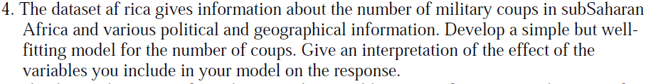

####Data

For the scope of the discussion, I have removed the observations that `NA` values. There are about `eleven` rows with `NA` values.

```
#Variables and Description

miltcoup - number of successful military coups from independence to 1989

oligarchy - number years country ruled by military oligarchy from independence to 1989

pollib - Political liberalization - 0 = no civil rights for political expression, 1 = limited civil rights for expression but right to form political parties, 2 = full civil rights

parties - Number of legal political parties in 1993

pctvote - Percent voting in last election

popn - Population in millions in 1989

size - Area in 1000 square km

numelec - Total number of legislative and presidential elections

numregim - Number of regime types
```

```{r, echo=T, message=F, warning=F}
library(dplyr)
library(knitr)
library(kableExtra)
library(faraway)
library(fBasics)
library(ggplot2)

Africa.df <- data.frame(africa)
Africa.C.df <- Africa.df[complete.cases(Africa.df), ]

Africa.C.df <- within(Africa.C.df, {pollib <- factor(pollib, levels = 0:2, labels = c("No Civil Rights","Limited Civil Rights","Full Civil Rights"))})

Africa.S.df <- Africa.C.df %>% select(miltcoup, oligarchy, parties, pctvote, popn, size, numelec, numregim)

tmp <-basicStats(Africa.S.df)
tmp <- data.frame(t(tmp))
tmp <- tmp[ , -which(names(tmp) %in% c("SE.Mean","LCL.Mean","UCL.Mean"))]
colnames(tmp)[which(names(tmp) == "X1..Quartile")] <- "1st. Quartile"
colnames(tmp)[which(names(tmp) == "X3..Quartile")] <- "3st. Quartile"
colnames(tmp)[which(names(tmp) == "nobs")] <- "Observations"

tmp %>%
kable(format="html", digits= 2, caption = "Sub-Saharan Africa - Miltary Coups And Politics Summary") %>%
kable_styling(bootstrap_options = c("striped", "hover", "condensed", "respons
ive"), full_width = F, position = "left")

table(Africa.C.df$pollib)

```

Distribution of military coups(`miltcoup`) and Political liberalization(`pollib`).

```{r, echo=T, message=F, warning=F}
ggplot(Africa.C.df, aes(miltcoup, fill = pollib)) +
  geom_histogram(binwidth=.5, position="dodge") + 
  labs(title = sprintf("Military Coups Vs. Political Liberalization")) + xlab("Number Of Successful Military Coups") +
  ylab("Count") + guides(fill=guide_legend(title="Political Liberalization"))
```

The plot shows the count of successful military coups is lower when countries have `Full Civil Rights`. In other words, the number of successful military coups increase when a country has `No Civil Rights`. It also tells, variable `pollib` could be a useful predictor in the model.

####Method
To solve the problem, I will be using `Poisson` regression method. Response variable of this model is `count`. `Poisson` regression is also known as `log-linear model` or `count regression`. The main assumption of `Poisson` regression is `mean` and `variance` is same.

Poisson regression, $$log(\mu) = \alpha + \beta X$$

$$\mu = e^{(\alpha + \beta X)}$$
$$\mu = e^{\alpha}\times e^{\beta X}$$

Where $\mu$ is expected value$(E(Y))$ or `counts`.

- When $\beta = 0, e^{\beta X} = 1$, resulting in expecting count$(E(Y) = \mu)$, meaning predictor variable $X$ has no impact on response variable $Y$.

- $\beta > 1$, expecting count$(E(Y))$, is $e^{\beta}$ times larger compared to when $\beta = 0$.

- $\beta < 1$, expecting count$(E(Y))$, is $e^{\beta}$ times smaller compared to when $\beta = 0$.

Coefficients have a multiplicative effect on response variable $Y$.

####Model

As model contains all the variables, it is known as a full model. 

```{r, echo=T, message=F, warning=F}
Africa.glm <- glm(miltcoup~., family = poisson, data = Africa.C.df)
summary(Africa.glm)
```

####Interpretation

- As `oligarchy` increases by one unit, `miltcoup`, number of successful military coups will increase by $e^{-0.2334274} \times e^{0.0725658} = `r ((2.71828)^(-0.2334274)) *((2.71828)^(0.0725658))` = `r round(((2.71828)^(-0.2334274)) *((2.71828)^(0.0725658)),0)`$ (rounded to `zero`), when all other variables held constant.

- As `parties` increases by one unit, `miltcoup`, number of successful military coups will increase by $e^{-0.2334274} \times e^{0.0312212} = `r ((2.71828)^(-0.2334274)) *((2.71828)^(0.0312212))` = `r round(((2.71828)^(-0.2334274)) *((2.71828)^(0.0312212)),0)`$ (rounded to `zero`), when all other variables held constant.

- As `pctvote` increases by one unit, `miltcoup`, number of successful military coups will increase by $e^{-0.2334274} \times e^{0.0154413} = `r ((2.71828)^(-0.2334274)) *((2.71828)^(0.0154413))` = `r round(((2.71828)^(-0.2334274)) *((2.71828)^(0.0154413)),0)`$ (rounded to `zero`), when all other variables held constant.

- As `popn` increases by one unit, `miltcoup`, number of successful military coups will increase by $e^{-0.2334274} \times e^{0.0109586} = `r ((2.71828)^(-0.2334274)) *((2.71828)^(0.0109586))` = `r round(((2.71828)^(-0.2334274)) *((2.71828)^(0.0109586)),0)`$ (rounded to `zero`), when all other variables held constant.

- As `size` increases by one unit, `miltcoup`, number of successful military coups will increase by $e^{-0.2334274} \times e^{-0.0002651} = `r ((2.71828)^(-0.2334274)) *((2.71828)^(-0.0002651))` = `r round(((2.71828)^(-0.2334274)) *((2.71828)^(-0.0002651)),0)`$ (rounded to `zero`), when all other variables held constant.

- As `numelec` increases by one unit, `miltcoup`, number of successful military coups will increase by $e^{-0.2334274} \times e^{-0.0296185} = `r ((2.71828)^(-0.2334274)) *((2.71828)^(-0.0296185))` = `r round(((2.71828)^(-0.2334274)) *((2.71828)^(-0.0296185)),0)`$ (rounded to `zero`), when all other variables held constant.

- As `numregim` increases by one unit, `miltcoup`, number of successful military coups will increase by $e^{-0.2334274} \times e^{0.2109432} = `r ((2.71828)^(-0.2334274)) *((2.71828)^(0.2109432))` = `r round(((2.71828)^(-0.2334274)) *((2.71828)^(0.2109432)),0)`$ (rounded to `zero`), when all other variables held constant.

- `pollib` describes political liberalization of a country, has an impact on `miltcoup`. Estimates `Limited Civil Rights` and `Full Civil Rights` of the model are in comparison to `No Civil Rights`. It can be explained as count of `miltcoup` will decrease to $e^{-1.1032439} = `r (2.71828)^(-1.1032439)`$, when `pollib` takes value of `Limited Civil Rights` over `No Civil Rights`. In other words, the count of successful military coup slightly reduces when a country has `Limited Civil Rights`. Also, `miltcoup` will decrease to $e^{-1.6903057} = `r (2.71828)^(-1.6903057)`$, when `pollib` takes value of `Full Civil Rights` over `No Civil Rights`. In other words, the count of successful military coup greatly reduces when a country has `Full Civil Rights`.

Full model also suggests variables `pctvote`, `popn`, `size`, `numelec` and `numregim` are not contributing to the model. In other words, variables are not useful in predicting an increase or decrease counts of `miltcoup` when other variables(`oligarchy`, `pollib` and `parties`) are not taken into account. 

####Final Model

Generating model without variables `pctvote`, `popn`, `size`, `numelec` and `numregim`.

```{r, echo=T, message=F, warning=F}
Africa_2.glm <- glm(miltcoup~oligarchy + pollib + parties, family = poisson, data = Africa.C.df)
summary(Africa_2.glm)
```

- As `oligarchy` increases by one unit, `miltcoup`, number of successful military coups will increase by $e^{0.207981} \times e^{0.091466} = `r ((2.71828)^(0.207981)) *((2.71828)^(0.091466))` = `r round(((2.71828)^(0.207981)) *((2.71828)^(0.091466)),0)`$ (rounded to `zero`), when all other variables held constant.

- As `parties` increases by one unit, `miltcoup`, number of successful military coups will increase by $e^{0.207981} \times e^{0.022358} = `r ((2.71828)^(0.207981)) *((2.71828)^(0.022358))` = `r round(((2.71828)^(0.207981)) *((2.71828)^(0.022358)),0)`$ (rounded to `zero`), when all other variables held constant.


- `pollib` estimates `Limited Civil Rights` and `Full Civil Rights` of the model are in comparison to `No Civil Rights`. It can be explained as a count of `miltcoup` will decrease to $e^{-0.495414} = `r (2.71828)^(-0.495414)`$, when `pollib` takes the value of `Limited Civil Rights` over `No Civil Rights`. In other words, the count of successful military coup slightly reduces when a country has `Limited Civil Rights`. Also, `miltcoup` will decrease to $e^{-1.112086} = `r (2.71828)^(-1.112086)`$, when `pollib` takes value of `Full Civil Rights` over `No Civil Rights`. In other words, a count of successful military coup greatly reduces when a country has `Full Civil Rights`.


####References
- https://en.wikipedia.org/wiki/Poisson_regression
- https://stats.idre.ucla.edu/r/dae/poisson-regression/

